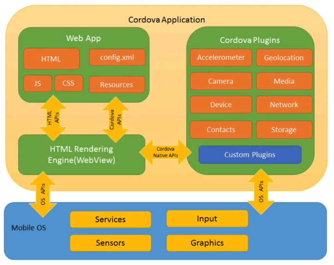

# Capacitor 2.0: Mobile apps & PWAs from one codebase

Link to the registered conference: [https://ionicframework.com/resources/webinars/capacitor-2-launch](https://ionicframework.com/resources/webinars/capacitor-2-launch) 

## Ionic Overview

### Ionic Framework

Ionic Framework ****is an open source  SDK _\(Software Development Kit\)_ for building **cross-platform** \(mobile and desktop\) applications using **web technologies**: HTML, JS, CSS. It comes with a lot of pre-built functionalities _\(sliding, swiping gestures, ...\)_ and UI Components _\(= high-level  User Interface building blocks\)_ but it can also be integrated with other UI frameworks such as Angular, React and Vue.js

All these functionalities and UI components are initialy dependant of the chosen platform \(Desktop, iOS, Android, ...\) and provided by specific SDKs. Thus the purpose of Ionic is to provide some kind of bridge between these native implementations and web technologies so that the developpers can use these functionalities out-of-the-box with web technologies.

### What is a Hybrid App?

Mobile developments represent a lot of use cases for the moment and a Hybrid App is one solution among others. A Hybrid App is a **native application** built with web technologies.

The UI provided by ionic is hosted in a **WebView** which is like an embedded browser wrapped in a native app shell. Because it's native, it has **full device access**.

Thus by implementing a Hybrid App the developers mostly use web technologies to build their UI components but they still have access to the native functionalities of the mobile device. From the point of view of the operating system \(IOs, Android\) a Hybrid App build with Ionic \(and Capacitor\) is a native application with its own binary and the WebView shell does a lot of background work to translate the code. 

### Cordova: native runtime

Ionic initialy uses Apache Cordova which is a development framework to build applications **for mobile devices** \(iOS, Android, Windows Phone\) using web technologies instead of a platform-specific APIs. 

Cordova provides the **native layer** which is required to access the functionalities of the device, it's a runtime tool: "_Write Once, Run Everywhere_". The code has to be written only once \(with web technologies\) and it can be executed on many systems, mobile and desktop. 

## Introducing Capacitor 2.0

### What is capacitor

Capacitor is the successor of Cordova for Ionic. It reimagins Cordova and gives a modern approach of how the web and native should work together: "_Code Once, Configure Everywhere_". Also it has support for Desktop applications, Web and PWA _\(Progressive Web Applications\)._

Thus it's a native **cross-platform** runtime for connecting web apps to native functionalities. 

Capacitor tries to stay as close as possible to the web browser standards to facilitate the maintenance.

### Capacitor 2.0

Capacitor2.0 comes with major new features compared to Capacitor and it's now the default for all new Ionic React & Angular projects:

* New plugins
* Support for Swift 5, Xcode 11+, Android 10, AndroidX
* Face and Iris Unlock
* ...

## Demo: Cordova migration

This demo shows how easy it is to migrate Cordova plugins to make them compatible with Capacitor2.0.

To do that the speaker shows us a test application and then brings a functionality which uses the camera of the device to convert the code from Cordova to Capacitor2.0

## References: 

* \[[Ionic in 30: introduction to Ionic](https://ionicframework.com/resources/webinars/ionic-in-30-introduction-to-ionic)\] 
* \[[Capacitor 2.0: Mobile apps & PWAs from one codebase](https://ionicframework.com/resources/webinars/capacitor-2-launch%20)\]
* \[[Reimagining Cordova: An Introduction to Capacitor](https://ionicframework.com/resources/webinars/reimagining-cordova-building-with-capacitor)\]

