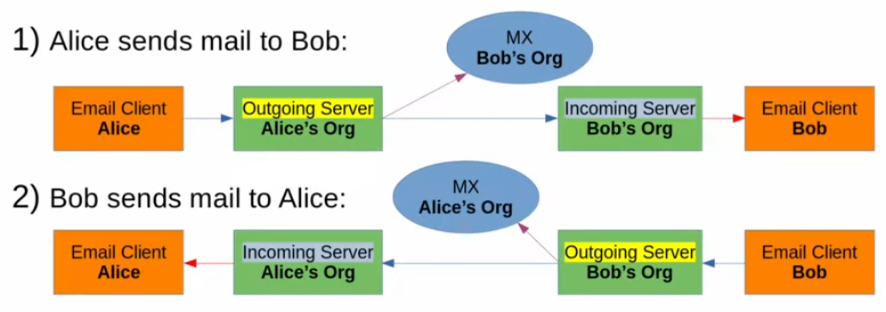
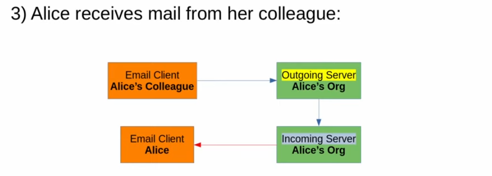
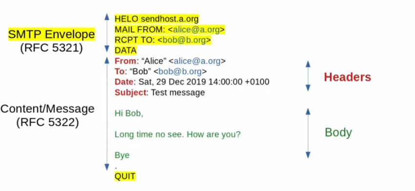
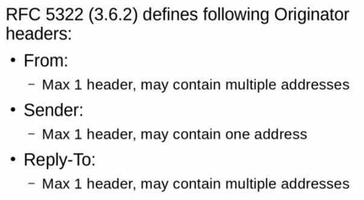
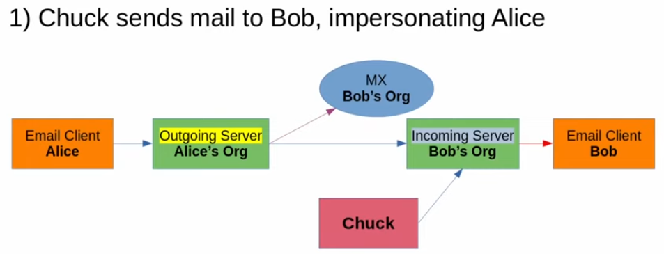
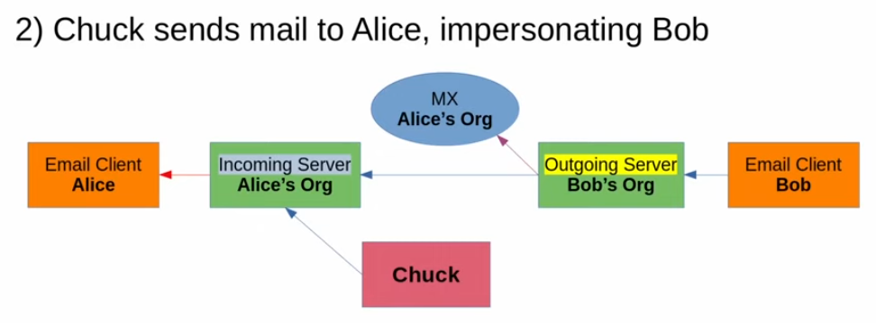
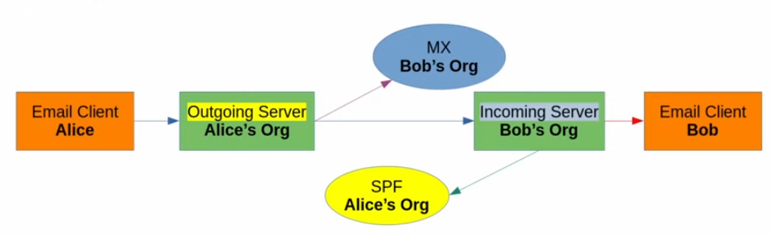
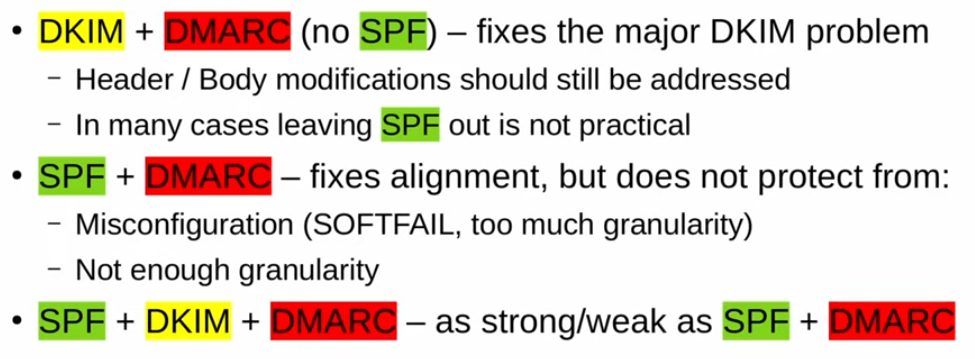

# Email authentication for penetration testers



Topics: _"How to fake an Email", "Email Conterfeiting", "Strategies for modern anti-spoofing"_

## Introduction - Why pentesters should care

 Everyone should start using **DEMARC** \( = _Domain-based Message Authentication, Reporting and conformance\)_ which is a email **authentication protocol**.

There are many different technologies that can be adopted to secure email usage and it can be difficult to know what should be implemented in the industry.

One way to choose from it is by doing some penetration testing. Looking the security of email form the perspective of an attacker is a great way to understand it and to adopt relevant countermeasures.

The email threat landscape is pretty large but this talk is focusing on the **spoofing. -**&gt; _attacks w/o any user-visible signs of tampering_

## Intro to SMTP

### Data Flow

SMTP is a protocol that underlies some email communications.

The following image shows the data flow happening when someone \(Alice\) sends an email to another person \(Bob\) from a **different organization**.

Normally each organization has its own **servers** for **incoming** and **outgoing** emails. If the company wants its domain to be accessible from others \(outside world\) than it has to be registered to some kind of DNS, the MX, which will give the IP address of the incoming server to the transmitter of the email.

Thus when Alice sends an email to Bob it first goes to the outgoing server which retrieves the address of  Bob's incoming server and sends the email.

For a penetration tester its important to think of about the different servers\(even if its physically on the same machine\): incoming/outgoing because they use different configurations thus we need to check for both of them. The client of the pentester only controls part of the protocol.

If Alice is communicating with a colleague than they are using the same domain \(same servers\) with two logical servers but in this case they both belongs to the same organization \(our client\).

### SMTP Structure and Standards

The SMTP protocol is a plain text protocol that involves an **enveloppe** and a **content** with some _headers_ and a _body_.

An interesting thing to notice is that each address appears two times: 

1. In the enveloppe \(MAIL FROM and RCPT TO\)
2. In the Headers of the content \(From and To\)

What is important to understand is that there are some standards defined for the headers but **in practice we can deliver messages with malformed headers.** Thus the penetration testers can play with this rules to find some breaches in the organization servers.

## Basic Spoofing

### Data flow in spoofing attacks

In this first scenario the pentester Chuch is spoofing Alice's email. He will send and an email to Bob pretending it comes from Alice. The email **won't go through** Alice's system \(outgoing server\)

In the second case the pentester is trying to send a spoof email to Alice pretending to be Bob. The email **go through** Alice's system.

The question is: _"which way is easier to protect?"_ \(Rep: even if we have some kind of control on the system in the second case the first one is easier to protect!\)

### A spoofed SMTP conversation

The SMTP protocol by itself **doesn't have any protection against spoofing**. If Chuck sends an email to Bob pretending to be Alice than the enveloppe and message of the email \(according to the protocol\) will look exactly the same as if Alice sent the email!

### Ad-hoc protection mechanisms

Because of these vulnerabilities, email admins tried to implement some non standards additional filters and protection mecahnisms for their organization. But in practice this is clearly **not sufficient** to be effective.

> Examples: 
>
> * checking if the sender \(MAIL FROM\) exists by sending back a message \(SMTP callback\)
> * trying to reach  the hostname of the HELO server by contacting a DNS server and compare the IP address

## SPF

The SPF \(_Sender Policy Framework_\) protocol add some additional protection. In this case when an email arrives to Bob's incoming server it will automatically check the ip address by querying a DNS back to see if it corresponds to the outgoing server of Alice's organization. 

### Spoofing mails protected by SPF

According to the configuation of the protocol it can drop the email or keep \(and maybe add some suspicion flag to it\) when the address doesn't match the expected one.  

So if the protocol is **wrongly used** \(common case...\) then it will practically do nothing against spoofing attacks.

### Checking wrong identifier

There is a **fatal design flaw** with the SPF protocol. It only checks the sender of the envelope \(MAIL FROM\) and doens't take into account the headers of the message \(From\). As we said before these two values can be different event if it's not a common practice. 

Thus an attacker could use a legitime address for the envelope \(so it will pass the SPF check\) with a different _From_ header. Because the user will only see the _From_ header it won't suspect the email coming from another person.

## DKIM

DKIM \(_DomainKeys Identified Mail_\) is a more granular protocol than SPF that uses cryptography to **sign** message body and some headers with a published key.

Every mail going outside a server with a DKIM protocol will get a signature that the receiver can verify by using the public key of the organization \(published in DNS\). 

### Spoofing mails protected by DKIM

The problem is that for the reciepter it's impossible to check whether there should have been a signature attached to the email. Thus even if it's hard to modify a DKIM header  it's possible and easy for an attacker to simply remove it.

## DMARC

_Domain Message Authentication Reporting and Conformance_ protocol.

Two terms important here:

1. Reporting: 

* 
1. Conformance: 

* Requires either SPF or DKIM to be passed for delivery \(the headers can no longer simply be removed\)
* Makes SPF check the _From_ header \(the attacker can no longer set different values for the sender in the envelope and the header of the message as a way of spoofing\)

### Spoofing mails protected by DMARC

The following picture sumarize the combinaisons of the three protocols, **SPF+DKIM+DMARC** being the best of all.

But because there is no way in DMARC to force the use of SPF and DKIM thogether as a penetration tester we can juste ignore DKIM, SPF being the weakest link.

Unfortunately even if DMARC is the best solution out there it's currently not widely used by the organizations.

