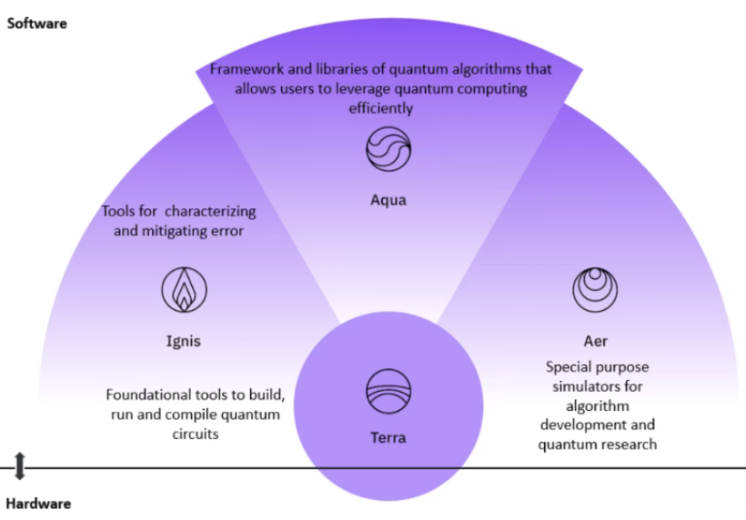
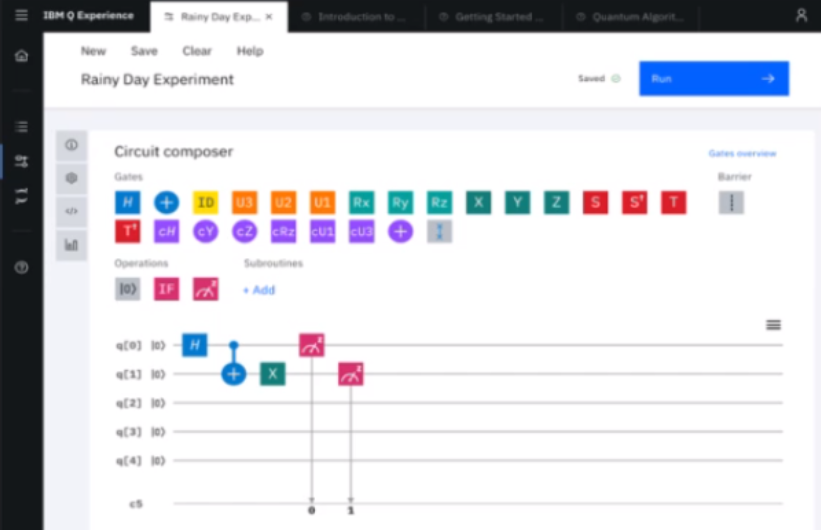
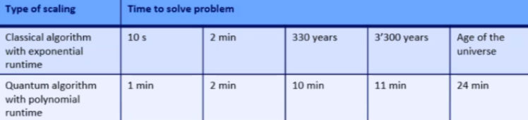

# IBM Quantum Computing

## State of the art \(harware and software\) - Important dates

#### Quantum science

Creation of the fundamental theoritical and physical building blocks of Quantum Computing \(QC\)

* 1970: Birth of quantum information theory
* 1996: DiVincenzocreiteria for building a quantum computer \(IBM\)
* 2007: the transmon superconduction qubit

#### Quatum ready

Materialization and preparation for the quantum computing era.

* 2016: IBM make quantum computing available on IBM Cloud \(IBM Q Network\)

#### Quantum advantage: next step

The goal for the next years is to demonstrate the utility of quantum computing for solving some specific kind of problems faster than the classical computing algorithms. 

Because not everything is mean to be solve by the QC the purpose now is to **identify the applications** and use cases that are concerned.

## Quantum Computing is based on essential ideas from quantum mechanics

The base unit of the QC is the **Qubit** which differs from the simple bit \(0 or 1\) used in classical computing up to now. Its properties come from the fundamentals of quantum mechanics:

* **Superposition**: by opposition of the bit which has only two possible states \(0 or 1, one at a time\), the qubit can be at the same time in an inifinity of different states which values are between 0 and 1. This property is the main advantage of using qubit.
* **Measurement:** forces a qubit to states of a qubit based on probabilities
* **Entanglement:** qubits are links together in a certain way, their quantum states are not independent. Thus by measuring a qubit we can deduce the states of another close qubit.
* **Quantum gates:** as logical gates \(OR, AND, + ...\) in classical numeric electronic, QC uses special gates to perform the basic computational operations on qubits

## IBM quantum computing system accessible in the cloud

IBM provides some kind of quantum computing hardware accessible in the cloud \(not yet a real QC but more like an emulation\)

BUT solving problems with QC is totally different from the classic algorithms and concepts that we traditionaly use. The users will have to prepare some kind of hybrid  "quantum-classical" algorithms that they will send to the quantum computer. Another computer is responsible to translate these algorithms in signals that will manipulate the superposition and entanglement of the qubits.

On envoit des signaux aux qbits pour manipuler la superpostion et l'entaglement.  le système est refroidit à 0.02°Kelvin , c'est une nécessité pour que le système agisse comme un ordinateur quantique.

## Quantum volume

Its important to understand that it's not only the number of qubits that defines the performance of the computation but also the way they are used.

The quantum volume is the **capacity to measure the performance gain** obtained by adding more qubits.This value is influenced by many technical factors. It's harder to optimize than a traditional computer.

For example one critical aspect is the topology of the qubits \(aka their interconnections\)

## How to use IBM Quantum Computer \(software\)

IBM provides the [**Qiskit Software stack**](https://qiskit.org/) ****for the developers to use the computer in the cloud.

* AQUA is the main component to program the computer. It allows the developers to add building blocks, algorithms and applications ready-to-use.

The programming is made with graphical blocks representing the quantum gates that are applied on the qubits.

## Applications domains and use cases

> _"The quantum computing may provide a new path to solve some of the hardest or most memory intensive problems for classical computers in business and science fields."_

Quantum computers will be very efficient for problems with an exponetial complexity.

There are many potential use cases where the use of quantum computing is expected to made a huge difference such as:

* Chemicals and petroleum
* Distribution an logistics
* Financial services
* Health care and life sciences
* Manufacturing

## IBM Q network

The IBM Q Network is a network of organizations composed of different kinds of contributors:

* Industry partners
* Hubs
* Members
* Startups
* Academic

Their aim is to build a network of partners to collaborate on the technology and make it evolve faster because for the moment it's still far from mature. IBM wish to accelerate the research and develop commercial applications.

Thus they organize training sessions, workshops, presentations,... accross the world to help people better understand what they do and to encourage them to join IBM Q Network in this journey towards the new era of quantum computing.

## Conclusion

Although the concepts behinds the technology \(quantum mechanics, quantum circuits, ....\) are really hard for me to understand I though this presentation was a nice introduction to see what's happening right now in the quantum computing era.

For sure there is still a lot of work to do and researches before the technology is fully functional. But when it will be mature it could potentiality make a huge disruption in the use cases presented before. 

