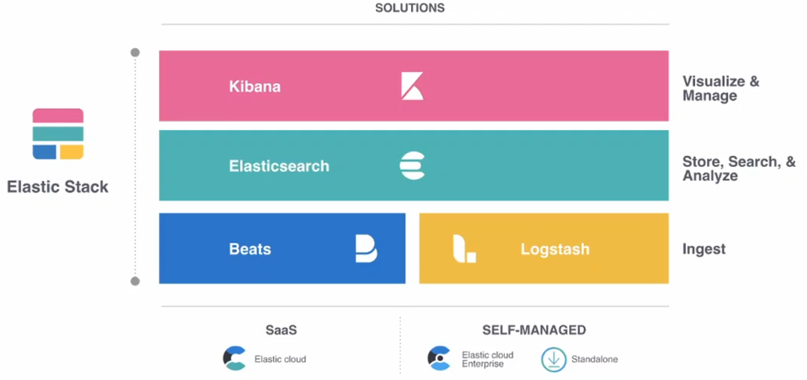
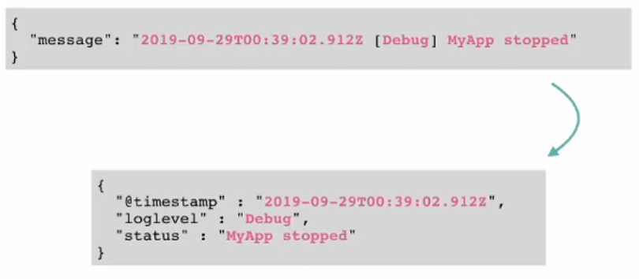
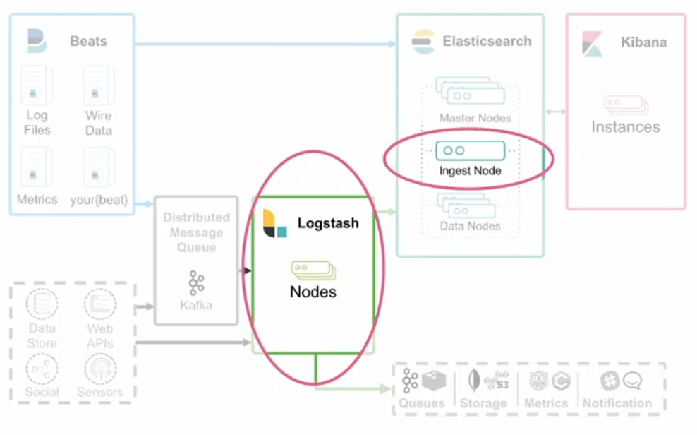
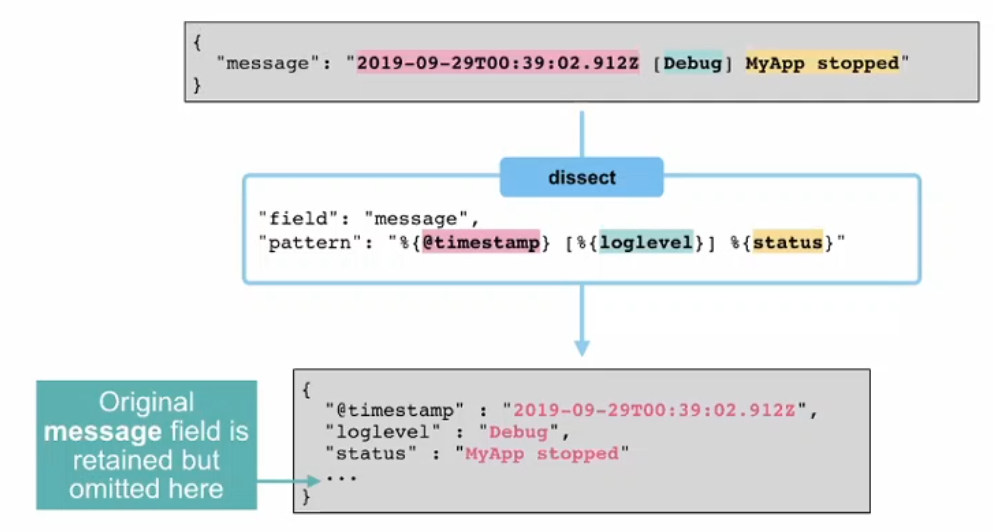

# Elastic Observability Engineer Training Preview: structuring data

This is a technical presentation about the observability in Elasticsearch. It's part of a larger training program proposed by the Elastic team. 

## Elastic and the Elastic Stack

Elastic is a company specialized in the **exploration and analysis of data**. They offer many open source products that can be used individually or as a whole stack.

### Kibana

Kibana can be considered as the top layer of the stack. It's a user interface that allows to view and manage the data. It's a great way to present the information with dashboards containing graphs, charts, ...

### Elasticsearch

Elasticsearch is the core layer that stores the data. It's not a classical database \(neither relational nor NoSQL\). Instead its a **reverse index** that allows to construct a distributed search engine for fast requests and analysis of the data.

### Logstash

As part of the ingest layer, logstach is a software component for data processing. It aggregates data from many sources, transforms them, then sends them to the storage layer.

### Beats

Beats is a family of softwares with dedicated purposes for the ingest layer.

## Structuring and Processing Data in Elasticsearch

Modules 7 & 8 from the official course on observability.

### Datasets

Data can come from many sources and in **many formats**. This is why we want to **first structure** this data **before storing** it.

Thus the goal is to **parse** and **transform** the unstructured data into discrete fields and make it easier to aggregate and visualize the data.

In the simple example below we can see that the log message is automatically parsed to structure the information as different fields: _timestamp, loglevel, status._

So instead of storing only the core message we get more precise information that represent a huge benefit when it comes to query and analyse the data. Our goal is to understand how we can create a nice pipeline that exctract this kind of information efficiently.

### Where can data be structured?

There are two places where the data can be strucured:

* within logstach
* within elasticsearch

### What's the difference? Elastic vs logstash

Most of the time we can get what we want with the pipeline of Elasticsearch. This is a straight solution which can be **easier** to implement instead of adding and configuring a logstach component \(if it's not already running in the stack\). The pipeline is a good starting point that can be scaled by adding new nodes.

On the other hand Logstash is a dedicated flexible **ETL tool** _\(Extract, Transform, Load\)_. Thus it can do further work than the basic pipeline of elasticsearch which has some limitations.

### What if your logs are not in a known format

If the data is not in specific format then it's necessary to build your own pipeline by defining the rules of the different **ingest processors** that transform and strucuture the data in a sequential way. This is the topic of the next section. 

## Elasticsearch ingest pipelines

### What is an ingest pipeline?

An Elasticsearch ingest pipeline is **a set of processors**. Each processor is dedicated to a specific task that will modify the documents passing through it. The processors are executed in a **sequential** way in the order they have been defined. So the input of a processor is the output of the previous one.

This process happens within the ingest nodes before the documents are indexed.

### How to define and test indgest pipelines?

The pipelines can be defined using the **ingest API** and tested with the **\_simulate** endpoint by providing a sample document.

Once a pipeline is defined you need to attach it to your index.

1. Within the Filebeat Elasticsearch output OR
2. Define a default pipeline for an index -&gt; every document will go through this pipeline.

## Processors examples

There are simple processors that are ready to use such as the **Split** processor which will divide the message on a particular character. But it's also possible to configure other processors to make more complex task...

### Dissect processor

We define a pattern \(like a kind of regular expression\) that tells the processor how to separate the message according to its structure -&gt; dissection.

### Script Processors

There are some existing processors that are already fully functional. But because its not possible to cover all the use cases, the developer can create his **own processor**. This is made by using a special syntax - _**Painless**_ scripts. 

This processors are usefull for example to do mathematic operations with pre-built java functions or complex conditional operations,...

The Painless lab is accessible through the cloud using cloud.elastic.co. It's a great Learning portal for training the syntax.

## Conclusion

This presentation was useful for any developer that uses Elasticsearch. It showed us some good practices to prepare the data before storing them in the indexes so that they are in a better format for analysis purposes.

What's interesting about the methods presented here \(aka the _indgest pipelines_\) is that it can be done directly within Elasticsearch. Thus this is a good way to transform the data for someone who is implemeting Elasticsearch in a small project or someone who doesn't have the time to learn how to configure and use an additional tool \(aka _Logstach_\).

Furthemore this process of transforming the data is something very common in the field of data analysis \(BI, ...\). We always want the data to be prepared/transformed in a way that it makes more sens for its analysis. Thus the techniques and concepts presented here can be generalized to a larger scope than just the elastic environment.

