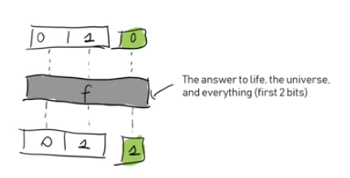
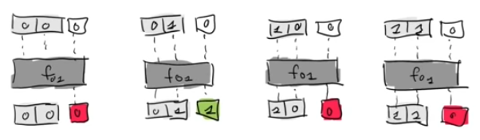
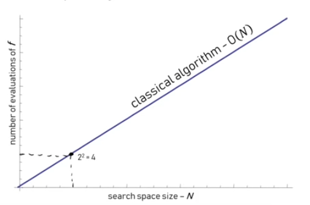

# Quantum Computing: Are we there yet?



## Short introduction to Quantum Computing \(QC\)

### Classic computing

Classical computers use **binary values** \(0 or 1\) they store in registers \(bit registers\) and they use functions on those bits.

On the following figure we can see an example of how a classical computer would solve a search problem. The function takes two bits in entry and return one bit as an output: 1 if the input bits correspond to the solution of the problem and 0 otherwise.

In this case, F is a very complicated function to implement and costly to execute.

 In the end for cases are possible: 00, 01, 10, 11 and only one will be the answer.

With such a paradigm of computing the time complexity of the search problem would be O\(N\).

_Can we make better? ..._

### Quantum computing

 Quantum computing \(QC\) is based on quantum-mechanics which stipulate that one can be in multiple states at the same time. Thus one of the key differences between classical computing and QC is the **superposition** property.

Qbits

#### Superposition

In classic computing we can only load on bit register at a time. InQC 

Due to some differences we can solve problems faster in QC than classical computing.

### Quantum Parallelism

Any classical function can be implemented on a quantum computer. The difference is that we can run this function on quantum states so we evaluate it for all the values in parallel but this is not that "perfect"...

### Quantum Gates

## Example of experimental QC speed-up

## Discussion of challenges and problems

## Surface code and error correction

## Google's Quantum supremacy experiment

## Outlook

