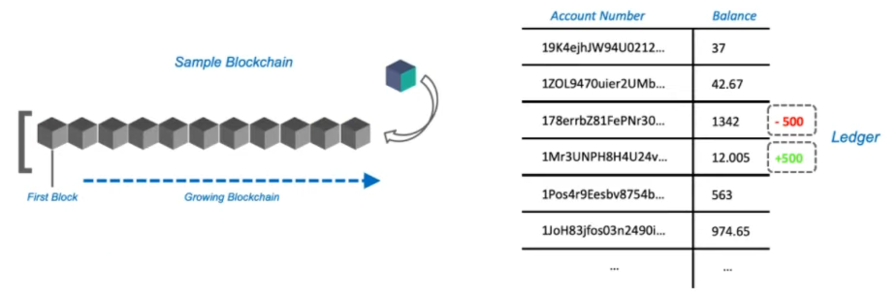
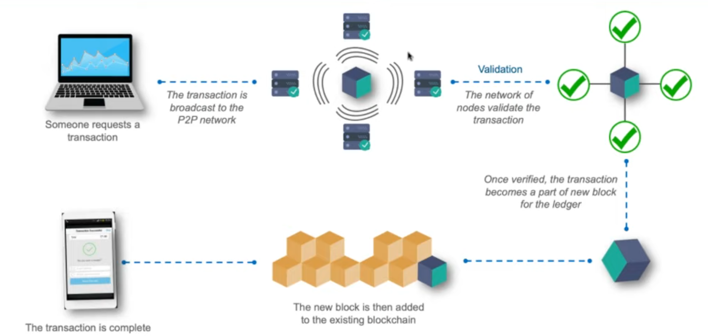

# Edureka Blockchain webinar \| Blockchain tutorial for beginners



## Introduction

This presentation is a general overview of the Blockchain technology. The applications and needs discussed here are mainly focused on the digital currency aspect of the blockchain.

## Needs for blockchain

### Issues with current banking systems

1. **Transaction fees**. Even if it is a little commition that seems nothing at the scale of a single paiement, applied to every transactions it represents a huge source of income for the banks. Anyway the participant of the transaction would be happier if they didn't have to pay that fee.
2. **Double spending.** The way that online transactions are made between banks is hard for them to face the problem of double spending. If someone as 500€ on is bank account and tries to pay 400€ to two other person at the same time it's hard to verify the process.
3. **Problems of trust.** The entities responsible for keeping the money of households are the same that can be responsible for financial crisis  and bankruptcy. 
4. **Problem of centralization** moreover in this crisis scenario we have seen that the banks can put some restrictions on the way people use their own money \(e.g limit on the withdrawal\).
5. **No transparency** in regard to your money and the investments made by the banks

### How bitcoin solves these issues

The Bitcoin has been invented to address these problems. It is a **digital currency** and it's the first application of the blockchain technology.

It consits of a **decentralized ledger** that is shared between all the users. Everyone involve in the chain can have is own copy of this public ledger. Moreover all the transactions from its beginning up to now are kept and can be consulted by anyone. Thus it's totally **transparent** system.

The way the technology has been designed make it **secure** and it ensures that none of the transaction can been manipulated as soon as it's written on validated block of the chain. The blockchain itself is **immutable**.

Because the users are only identified by their public key it's more completicated to know who are the persons involved in a transaction \(BUT it's not completely anonymous because someone could potentienlaly somehow link a public key to its user...\)

## What is the Blockchain and how it works

As mentioned before the blockchain is the technology behind the Bitcoin. It's has been created and made [publicly available](https://bitcoin.org/bitcoin.pdf) on the Internet in 2008 by some anonymous designer.

The blockchain is a chain of blocks that are tied toghether. Every new block added to the chain is linked to the previous by their signature. \(_REM:_ _Technical details are not discussed in this presentation_\). Thus is someone tried to change the content of a block it would break the rest of the chain.

As the blockchain grow it becomes more and more stronger and the information it contains becomes more trustworthy. 

### Bitcoin transaction

_Example: James wants to transfer 500 bitcoins \(BTC\) to  Kevin..._

Every new transaction is a part of the next block \(that contains many other transactions\) that will be validated by miners before it's added to the chain.

Every miner will check the balance of the creditor account to see if there is enough to make the paiement \(REM: the balance itself is not stored explicitly. It's always calculated by adding up all the previous transactions recorded on the blockchain for that account\). Then the block will be validated with complex mathematical operations. These operations require computational power that is provided by the miners \(with GPUs or dedicated "computers"\). The miners that can solve the mathematical problems will get a reward \(some BTC\).

Once the block is confirmed and added to the blockchain then every node in the network \(the miners\) gets a copy of that new block to keep the contain of the chain up to date. 

### Blockchain properties

The blockchain is based on three major tehcnologies:

1. **Private key cryptography:** to secure identities and hash functions to make the blockchain immutable
2. **Peer-To-Peer \(P2P\) Network:**  to maintain the consistency of the distributed ledger
3. **Blockchain program:** to specify the requirements of the protocol 

## Blockchain Applications

The blockchain is a **concept** that can be implemented in any programming language to address many different use cases \(the Bitcoin and the digital currencies are only one example\).

In any blockchain all the transactions are logged and kept within the blocks. Each node of the network owns a full copy of the entire blockchain. 

The feasability resposes on the competitive miners that provide computational power to validate the blocks.

### Types of blockchain

* **Public:** everyone can see, verify and use the blockchain.
* **Private:** only specific people of the organization can verify and add new blocks but everyone is allowed to view it.
* **Consortium:** a group of organizations \(ex: banks\) maintain the blockchain that's publicly available

### Example of use case

* The blockchain can be use for an **election.** It will track and count the votes avoiding fraud.

## Conclusion 

This "non-technical" presentation was a good overview of the main concepts about the blockchain technology. 

It was mainly focus on the financial sector which is represent the fundamentals problems that lead to design such a technology.

Thus we saw how this decentralized P2P network address this concerns and solve them with security, transparency et resilience.

