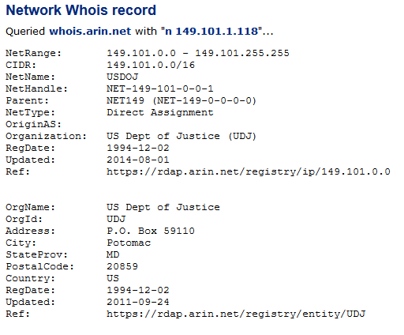
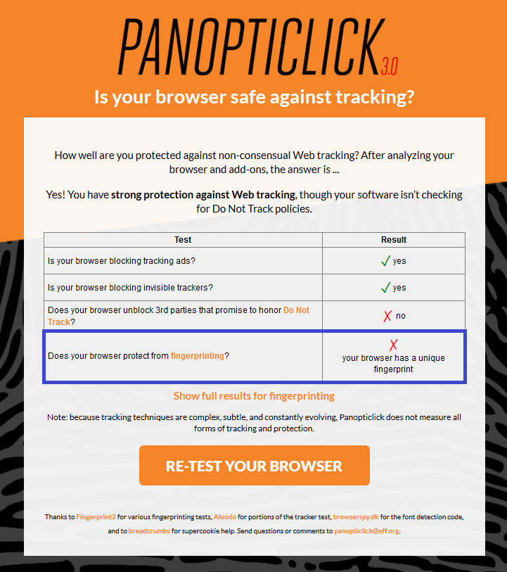
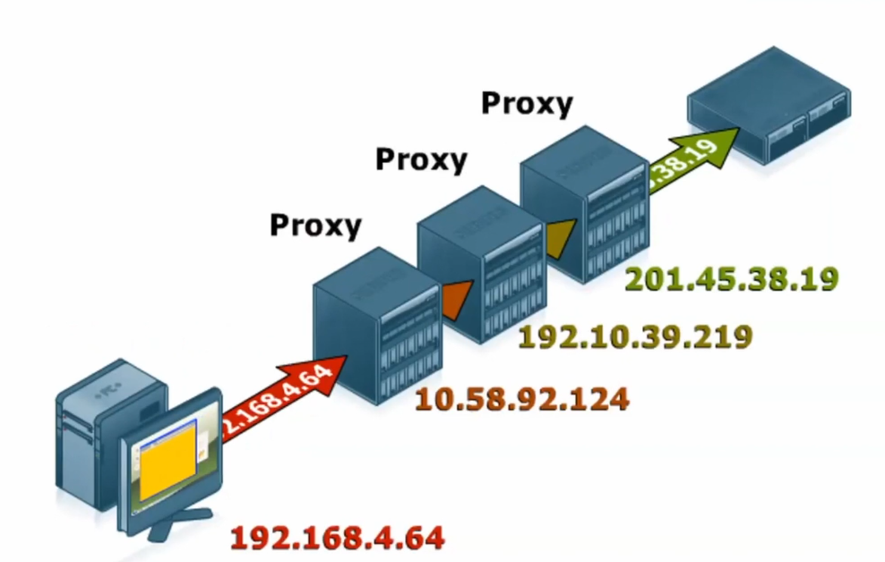
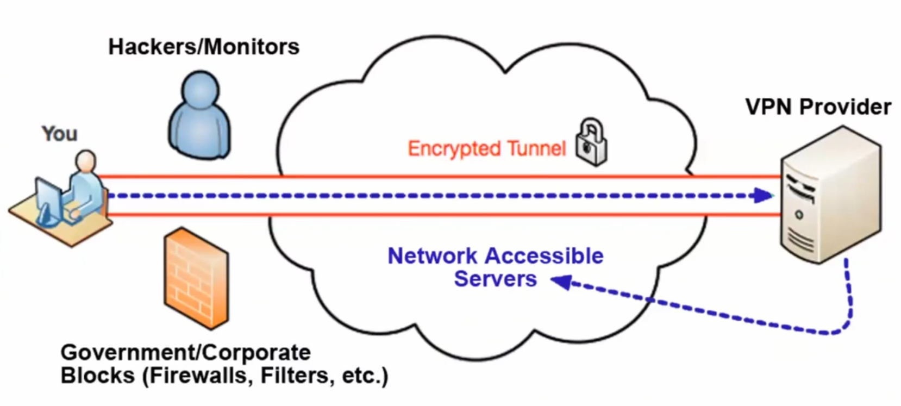

# What Investigators Need to Know about Hiding on the Internet: Proxies and VPN



## Introduction

## Internet

A first thing to remember is that the web constitues only a small part of the Internet. There are other services running on the Internet Network that we tend to forget about such as:

* VoIP
* Video Calling
* Online Gaming
* File Sharing \(P2P,  ...\)
* Internet Video
* ...

Thus there is a lot of stuff happening on the Internet that's not part of the World Wide Web \(WWW\)

## Fingerprint \(FP\)

The web \(1990\) has been designed in such a way that any server you look at on the web can also "look back at you". The domain reached by the user gets information about him through differents methods: Ip fingerprinting, browser fingerprinting and device fingerprinting.

They automatically give information about the user's internet connection when he is connecting on a website: **passive tracking**

But there are also other ways to identify and track a user activity on the web: **active tracking**.

### **IP fingerprinting** 

#### Passive fingerprinting

When you go on a website you're automatically passively giving information about your Internet connection \(IP address, server name,...\) to this website. 

#### Active fingerprining

By **resovling** an ip with a [**whois search**](https://centralops.net/co/)**,** we can even get more details about a particular internet connection. 

On the following example we can see that the result gives us the US Departement of Justice is the organization that ownes the ip addresses range 149.101.0.0 - 149.101.255.255 that correspond to our research.

Then we can also get some approximation of its localization by using **geolocation** services such as [https://www.maxmind.com/en/home](https://www.maxmind.com/en/home)

This kind of ip geolocation services are also used by websites to **adapt their content** based on the user's location \(this process is called "**ip geo redirect**"\)or to block the access.

### **Browser fingerprinting**

#### **Passive fingerprinting**

When a browser is accessing a website it automatically gives information about it such as: HTTP headers, OS version, Browser type and plugins, time zone, screen size, fonts, cookies enabled, ...

This website [https://panopticlick.eff.org/kcarter](https://panopticlick.eff.org/kcarter) provides a great service to test what information is collected about our broswer when we are surfing on the net.

What's interesting to notice is that all the information given by my browser makes it unique among others. Thus my browser has a **unique fingerprint** which is bad if I am trying to hide on the web. In other words it would be better if my settings/information were the same as other people.

#### **Active fingerprinting**

Websites may store **cookies** on the user's browser. A cookie is a **unique serial number** **that identifies the browser** on this website or any other website in parternship with this one. Thus they can track part of the user's activity on the web.

### **Device fingerprinting**

Whatever electronic device is used to go on the Internet \(computer, smartphone, playstation, ...\) there is always a **quartz crystall oscillator** solder on the motherboard. It's serves as a time base for the device.

Every oscillator vibrates at a unique frequency due to some offset that makes it act as a fingerprint for the website that gets this information. 

## How to hide

There are many ways to hide our information and activity on the Internet but the ones  that will be covered here are: **Proxies** and **VPNs**

### **Proxies**

A proxy acts as intermediate node between the user and the wesbite so that the website see the ip of the proxy and not the ip of the user. Thus the user hide himself behind one or more proxies.

If the proxy is **bulletproof** it means that there is no way to trace back the user. This can be due to the legislation of the country where the proxy is located. There may be no obligation for them to keep logs about the connections.

#### Problems with proxies

* The traffic is **not encrypted**. It means that people who owns the proxy could see the user's activity \(typical use of honeypot\)
* Cost vs Lawful. A free proxy could be a scam or a corrupted server.
* How can you be a 100% sure that the proxy doesn't store **log files**?

### **VPNs \(Virtual Private Networks\)**

A VPN can do pretty much the same thing a proxy does but in addition it encrypts the connection all the way from the user's device to the VPN provider.

By doing so the internet traffic can be intercepted by some malicious people \(our the ISP\) but he won't be able to understand the content. 

For someone who is trying to hide its activity on Internet its important that its VPN provider has the follonwing properties:

1. No logs
2. Fast Speed
3. Cryptocurrency as payment option
4. Located in country that does not have MLAT with its own country
5. Endpoints in several countries

## Conclusion

In this presentation the instructor gave the fundamentals basis of fingerprinting on the Internet. 

What was interesting was the demonstrations and tools references he gave.

As a prior investigator he really knew what it's like to hide and search fo people on the Internet.

