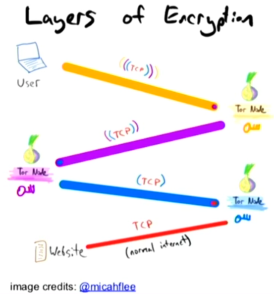

# State of the Onion: The Road to Mainstream Adoption and Improved Censorship Circumvention



The topic of this presentation is the evolution of the tor project over the last year and what is expected for the futur.

## What is Tor?

Tor is many things...

### Tor: Open Source software

It's a free and open source software which grant access to the Internet with a focus on the privacy of the users.

### Tor: Network

It's a network of **decentralized** servers run by volunteers and organizations.

The network is composed of nearby 6500 nodes and it can be accessed freely and without registration through the Tor Software. The goal is to preserve **anonimity**.

#### How it works briefly...

The request of the user is encrypted and bounces between many relays \(at least 3\) before it reaches its destination. Its made in way such that:

* The first node knows who has made the request BUT it doesn't know the content and the destination
* The middle node doesn't know who has made the request neither the destination
* The last node \(_exit node_\) doesn't know the sender BUT it knows which website has been visited by the request 

The request has **many encryption levels** \(as many as the intermediate nodes by using their public keys\) as an Onion has many layers. 

Each relay is aware of the nodes before and after him and it will be able to decrypt the outter layer of encryption with its own private key.

### Tor: Community

Tor is also a community with many different people:

* **Users** who are searching for anonimity while searfing on the Internet \(ex: activists, journalists, ...\)
* **Digital security trainers** who are spreading the use of the technology accross the world and training people how to use it
* **Software developers** who implement new features, find bugs,...
* **Relay operators** who run and maintain the machines that make the network
* **Researchers**

### **Tor mission...**

> _Tor mission is to advance human rights and freedoms by creating and deploying free and open source anonymity and privacy technologies, supporting their unrestricted availability and use, and furthering their scientific and popular understanding._

## What has been done in 2019

The entire work is distributed accross different teams...

### Network Team

They maintain the software that runs on each relay.

### Applications Team

They develop the tor browser which is based on firefox and allow access to the Internet through the Tor network and also to services which are only available on the network.

They released the stable version of Tor Browser for Android.

They are trying to make the software as userfriendly as possible by integrating many features that were available only with addons up to now. Thus they are trying to improve the user experience by making the software more intuitive.

### 

## What is coming up in 2020

### Scaling the tor Network

### Mainstream Adoption

### Keep the Tor Network healthy

Looking at the relays 

Everything related to the status of the nodes within the network

