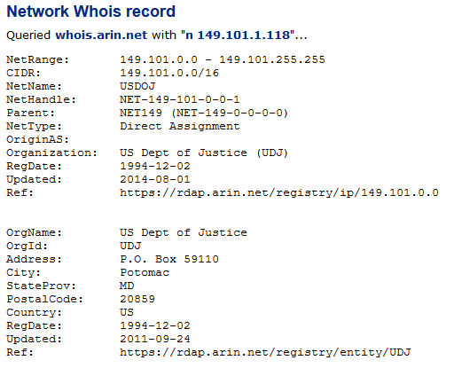

# What Investigators Need to Know about Hiding on the Internet: Proxies and VPN



## Introduction

## Internet

A first thing to remember is that the web constitue only a small part of the Internet. There are other services running on the Internet Network that we tend to forget about such as:

* VoIP
* Video Calling
* Online Gaming
* File Sharing \(P2P,  ...\)
* Internet Video
* ...

Thus there is a lot of stuff happening on the Internet that's not part of the World Wide Web \(WWW\)

## Fingerprint \(FP\)

The web \(1990\) has been designed in such a way that any server you look at on the web can also "look back at you". The domain reached by the user gets information about him through differents methods: Ip fingerprinting, browser fingerprinting and device fingerprinting.

They automatically give information about the user's internet connection when he is connecting on a website: **passive tracking**

But there are also other ways to identify and track a user activity on the web: **active tracking**.

### **IP fingerprinting** 

#### Passive fingerprinting

When you go on a website you're automatically passively giving information about your Internet connection \(IP address, server name,...\) to this website. 

#### Active fingerprining

By **resovling** an ip with a [**whois search**](https://centralops.net/co/)**,** we can even get more details about a particular internet connection. 

On the following example we can see that the result gives us the US Departement of Justice is the organization that ownes the ip addresses range 149.101.0.0 - 149.101.255.255 that correspond to our research.

Then we can also get some approximation of its localization by using **geolocation** services such as [https://www.maxmind.com/en/home](https://www.maxmind.com/en/home)

This kind of ip geolocation services are also used by websites to **adapt their content** based on the user's location \(this process is called "**ip geo redirect**"\)or to block the access.

### **Browser fingerprinting**

#### **Passive fingerprinting**

When a browser is accessing a website it automatically gives information about it such as: HTTP headers, OS version, Browser type and plugins, time zone, screen size, fonts, cookies enabled, ...

This website [https://panopticlick.eff.org/kcarter](https://panopticlick.eff.org/kcarter) provides a great service to test what information is collected about our broswer when we are surfing on the net.

What's interesting to notice is that all the information given by my browser makes it unique among others. Thus my browser has a **unique fingerprint** which is bad if I am trying to hide on the web. In other words it would be better if my settings/information were the same as other people.

#### **Active fingerprinting**

Websites may store **cookies** on the user's browser. A cookie is a **unique serial number** **that identifies the browser** on this website or any other website in parternship with this one. Thus they can track part of the user's activity on the web.

### **Device fingerprinting**

## Conclusion

