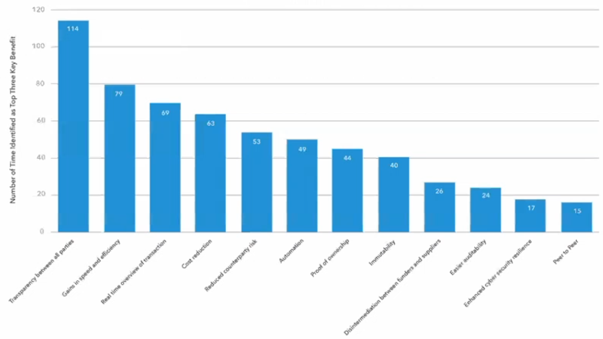

# Women in enterprise Blockchains

## Introduction

### _Alisa DiCaprio_ from [R3](https://www.r3.com/)  

### 2008 - 2019

Since the begin of the blockchain, the technology has kept growing and growing. These progresses were made globally accross the industries in the world and there was no hub for innovation.

There were long term deployments and the cloud structures offered some benefits in the technical uses of the blockchain.

### March 11 2020

#### Declining world trade and BCP implementation

Since the begining of the COVI-19 crisis worldwide there was a decline in the world merchandise trade and all the regions were impacted.

However an interesting thing to notice is that accross the world, everybody was capable to **go digital in crisis situation**.

For example, all banks had to establish **business continuity plans** because nobody could go physically and they couldn't stop their activity.

Thus within a few weeks we saw that the industries were capable of adopting new rules and processes to continue their activity online. The International Chamber of Commerce came with some guide of good practices.

### Blockchain's new path

#### Enterprise implementations

Enterprises **need to go digital** but not with some ramdom technology. It has to be suited with their needs regarding the security, the scalability, the intergration, their main activity,....

The Blockchain is a functional tool in the **digital transformation** to help other technologies to scale up and down. 

## Part 1 - Identity

> _How organizations are balancing the need to secure personal privacy with the requirements to properly identify the parties involved in business transactions._

### _Dr. Amber Ghaddar_, AllianceBlock

Until now there are some problems **of trust** in the financial trades. When making a deal with some organization/people, we can't always be sure of their identity.

This is something we saw happening recently during the COVID crisis when countries bought masks to some enterprises that were pure scams. With the emergency of the situation they were in a hurry to buy these products and they didn't really know who they were speaking to and even if these selling organizations existed for real.

Moreover in this case of trade we are not speaking about two intervenants but many at a time: the **buyer** get in touch with a seller, the **seller** has a supplier, the **supplier** is in touch with an **authorized distributor** who is in contact with the **factory**. Thus for each intervenant there is a risk of fraud about its identity that you need to validate yourself by making researches. This can be a tremendous process.

Another simpler approach would be a "unique" platform where any intervenant in the world could identify himself giving some proofs about who he is. Such a system could be done with a blockchain.

However this change would cause some disruption in the way things work today. In a sector such as financial trading, which is heavily regulated, this is something that will be hard to implement.

**Self-Sovereign Identity** is a model for managing digital identity in which a person/organization has a total control on its own data. These could be crossed data from social media, photos, medical records,... anything that the user chooses to publicly share. That could be stored and secured within a blockchain. Moreover everyone could monetize his own data instead of having big identities \(Facebook, Google, ...\) selling our data to other companies.

### _Genevieve Leveille_, Agriledger

In her speech Mrs Leveille presents a concrete implementation of the Blockchain to track the process of selling mangos from a farmer in Haïti to the consumer. 

In this use case the interest of the blockchain is for the consumer to be able to **identify** the product he is bying. In other words to get every information about this mango from its harvest in Haïti, its worldwide transportation up to the shelving in the store. Every single stage of the process is tracked and kept in the blockchain so that the buyer can access these information by scanning a QR code on the mango.

This is a way for the consumer and any intervenant to get **insurances** about the product they are bying/selling and its quality because now  they can get the confirmation that the mango has passed every validation tests \(temperature, conservation, ...\).

### _Laura De Giovanni_, Tiiqu

The speaker points out two problems:

1. There are lots of cases of **identity theft** every year. It can be hard for a someone to keep his own identity private.
2. People can **lie about themselves** \(ex: job interviews\) and it's hard to verify what they claim.

There is a global trend about Self-Sovereign Identity with the following benefits:

* One login for everything on the net
* More privacy and control for the user on its own data and how he shares it
* No more paperwork
* More transparency

This SSI model could be great for users to protect their own data but there is no benefit regarding the trust. Some data can be subjectives and people could still lie about themselves.

At Tiiqu they have developed two technologies:

1. a **Passport** for collecting immutable credentials
2. a **Score** for measuring trustworthiness.

Their goal is to create a new way to make fair decisions by building trust when someone has to prove who he claims to be.

## Part 2 - Trade

> _What its like to smoothly transition from traditional centralized sustems to decentralized and ditributed ledgers._

### _Emmanuelle Ganne,_ Economic Research Department WTO

There are three main reasons for the adoption of the blockchain within the trade market:

1. Enhancing transparency for the customer and increase the trust
2. Prove the authenticity of products and fight conterfeits
3. Quickly track products

With her research department they lead an investigation about the key benefits of the blockchain for the trade market and below are the results.

According to her, the COVID crisis has shown us that tracking becomes a vital operation in the trade market. It's important to connect platforms and market places to ease supply chain disruption.

## Part 3 - Sustainability

> _Are there blockchain benefits for developing countries, those that are especially sensitive to sustainable trade practices._

### _Krystal Webber_, IBM

Her talk focuses on Blockchain **network design.** For her it's important to remember that "_we are using blockchain technology to **enable business transformation** at the level of a market, industry or ecosystem_".

Going to scale with blockchain can be a long journey. The biggest part is to be able to precisely define the business that we want to digitalize.

### _Virginia Cram Martos,_ Triangularity SàRL

Trade and Blockchain technology fit the description of the **United Nations 2030 Agenda** which emphasizes the role of commerce, innovation and digital technology.

According to her the key for a sustainable business and blockchain is the **collaboration** based on **agreed rules**, **shared truth** and **real time access.** These are the main caracteristics of a blockchain.

The business rules are implemented by contracts on the blockchain. These contracts define conditions, transactions timing, payments,...

The shared truth corresponds to the transparency of many aspects of the trade: product tests, authorizations, timing of events, status of payments, certificates,...

Real time access is the fact to provide parties of the trade with the latest information of these previously cited properties as soon as they are available.

### _Montse Guardia Guell_, Alastria Blockchain Ecosystem

We are in an **age of transition,** it's time for us to change the way we are looking at things and create something new to really get the benefits of becoming digital.

One of Alastria's mission is to democratize the access to blockchain by providing tools to promote access, adoption and use of the technology.

The added value of the blockchain is to create a sustainable ecosystem. A way to do it is by thinking at the new rules that we are establishing through the technology and by trying to standardize them. Thus for her, the sustainability is also a question of human and organizations collaboration to improve this technology together and the way we ware implementing it today.

## Conclusion

This was a great long conference. All these women have a great view of the business they are leading and the way the blockchain could be the next step for the financial market.

The digital transformation should be a priority for the enterprises today. In some case the blockchain could be the technology they need to achieve their digitalization. 

Because the implementation of the blockchain in a sector such as the financial market is a huge disruption that's hard to integrate, it's really important that organizations and people think together and collaborate to design the rules that will guide us through this changes.

